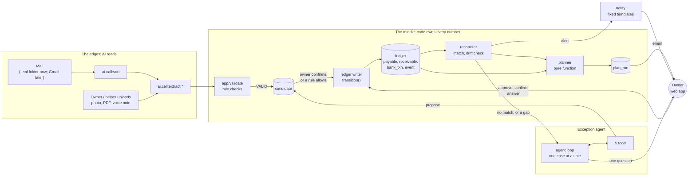
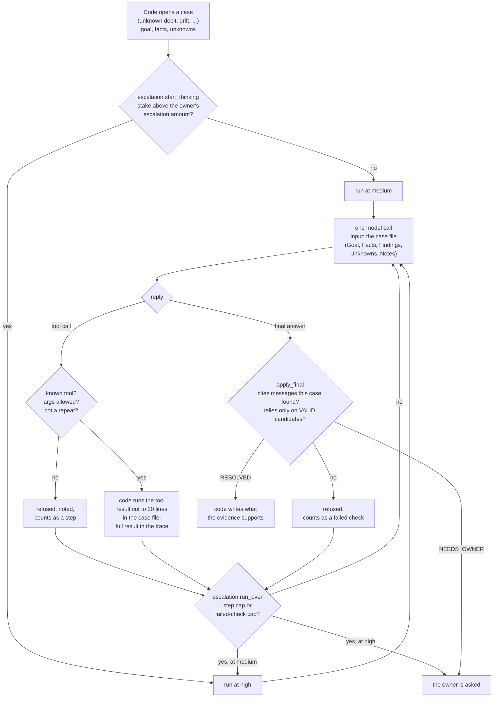

# Architecture

AI reads the messy world at the edges: mail and the owner's uploads. Plain code
owns every number in the middle: the ledger, the planner and the rule checks.
The model never calculates an authoritative value, and it has no tool that
approves a payment or marks one paid.

## The whole system

- The arrows into `writer` are the only way the ledger changes.
- The AI boxes (`sort`, `extract`, the agent loop) have no arrow into the
  writer. An import-linter contract enforces that, and so does the writer
  itself, which refuses any actor starting with `agent:`.
- `notify` is reached only from code (the reconciler and the case runner),
  never from `app.ai` or `app.agent`. That's another import-linter contract.

## The agent loop, its context, and its control points

**The five tools.** `search_gmail`, `get_ledger` and `run_planner` read. The
first reads only this business's mailbox; `get_ledger` uses a read-only
connection and returns at most 50 rows; `run_planner` is a what-if that writes
nothing. `add_candidate` proposes a record, which is rule-checked and never
goes into the ledger directly. `ask_owner` asks one plain-text question and
ends the run. The generated table is in
[permission-model.md](permission-model.md).

**Context management.** The model sees only the case file
(`app/agent/case_file.py`): five parts, rendered by code from the case's state.
Code writes the goal, facts and unknowns when it opens the case. Findings (each
with its source) and notes are added step by step. A tool result is cut to 20
lines in the case file, and the full result goes to the trace. Each step is one
fresh call with the current case file. There's no growing chat history.

**The control points**, each a place where code, not the model, decides:

| Control point | Where |
| --- | --- |
| The writer refuses every `agent:*` actor, before any SQL | `app/ledger/writer.py` |
| Rule checks on every record the AI reads or proposes: schema, amounts, GSTIN check digit, invoice and statement arithmetic, dates, duplicates, bank details | `app/validate/` |
| Escalation: the starting level by stake, the step cap, the failed-check cap, rerun at high, then the owner | `app/agent/escalation.py`, `config.yaml` `escalation:` |
| A stale plan can't be approved (409) | `app/web/actions.py::approve` |
| The import contracts: `ai` never imports ledger, db or web; `agent` never imports the writer, web or the pipeline; `ai` and `agent` never import notify | `pyproject.toml` `[tool.importlinter]` |
| The evidence check on a final answer | `app/jobs/run_case.py::apply_final` |
| Every answer the owner gives is applied by code | `app/web/actions.py` |
| The planner is a pure function: no I/O, no clock, no network | `app/planner/` |

## Time, money and traces

- **Money** is integer paise everywhere. No float ever holds an amount
  (`app/domain/money.py`).
- **Time** is read through `app/clock.py`'s `Clock`. Demo mode and the evals
  run on a fake clock.
- **Traces:** every step, whether a model call, a tool, a rule check or an
  escalation, is one JSON line (`app/trace/tracer.py`).
  Each line has business time and wall time; a model call also has its latency, attempt and retries.
  [docs/traces/](traces/README.md) has the official live pair (a failure and the same case's success) and a
  fixture pair, with walkthroughs.
- **Jobs:** the worker (`app/worker.py`) runs a SQLite-backed queue
  (`app/jobs/queue.py`). It retries with backoff, reclaims stale locks, and
  writes a heartbeat that `/api/health` reports.

## Trade-offs and decisions

The decisions that shaped the system, and what each one costs. A few have a short label (D10, D26, ...)
because code comments and tests refer to them; this table is where each label is defined.

**The model reads; code decides.**

| | Decision | What it costs |
|---|---|---|
| | **Code owns every number.** The model extracts text ("Rs.1,80,000", "dedh lakh"); code turns it into integer paise, plans, matches and checks. | A parser per format. An amount the parser can't read goes to the owner instead of being guessed. |
| D29 | **A voice bill's amount must be the transcript's own.** It passes only when the transcript says exactly one money-shaped amount and that amount equals the model's, in paise. | False flags, where the owner types the amount, and limits that only meaning could catch. The owner confirms every voice bill with the transcript beside it. |
| D30 | **Five or more bare digits are money; four (a year) are not.** | A long invoice number beside the amount is a false flag. |
| D28 | **A spoken currency word ("rupaye", "rupees") is noise, and the owner fills the fields the page marks.** A day number next to a month name is a date, not more of the amount. | Every field the model left empty is marked for the owner to fill. |

**The owner holds authority; the agent holds none.**

| | Decision | What it costs |
|---|---|---|
| D26 | **A vendor's first bank details, from any document, wait for the owner.** Confirming a bill never approves its bank account. | One more question when a vendor's details are first seen. In return, an email can't redirect a payment. |
| | **An agent's answer is applied by code, against evidence:** a cited message its own search found, a VALID candidate, and for a drift, an alert that closes the gap. | Some correct answers are refused and retried. The ablation's `no_evidence_gate` measures what the gate is worth. |
| D21 | **What the agent found says so in the audit trail:** `agent:case:<id> via gmail:<message id>`. | Longer source strings. |
| D12 | **A bill the owner already marked paid can still match its debit.** | The reconciler checks PAID bills with no linked debit, as well as approved ones. |
| D18 | **An authorisation to dip below the safety amount is bounded** by the lowest balance the owner was shown on that day, and lapses if the plan goes deeper. | The owner may be asked again when the plan changes. |

**The ledger is state, and only the writer changes it.**

| | Decision | What it costs |
|---|---|---|
| D10 | **Drift and the reported balance are ledger state, under the write guard.** | Every balance report is a writer call and an event. |
| D11 | **A statutory amount nobody knows yet is MISSING: it has no payable, and the owner is asked.** The planner never invents an amount. | The plan warns until the owner gives the amount. |
| D27 | **Statutory payments match by payee words per tax type.** A debit that names no tax office asks the owner. | A list in `config.yaml` to keep current. |
| D19 | **An invoice's round-off is allowed up to ₹1.00, and only as an explicit line.** | An invoice that rounds silently fails its arithmetic check. |

**The evidence is generated, never typed.**

| | Decision | What it costs |
|---|---|---|
| D15 | **The demo's fixture AI says what it is:** canned replies, no tokens, a banner, never a quiet fallback to Gemini. A document with no canned reply is reported as AI-unavailable. | The demo covers only the documents it has replies for. |
| D23 | **A regression is caught on its path, not only its result:** trajectory checks, and path budgets in every agent scenario. | Budgets to set from live runs and revisit. |
| D24 | **The harness comparison is fair:** the same inputs, model and outcome checks for every harness, and one request timeout for all. | The bare harness hears the inputs as text, because it has no ingest pipeline. |
| D25 | **No figure is typed into a hand-written page.** Reports carry the numbers, and `make check-evidence` re-derives every committed fixture report and derived page. | Pages point to reports rather than quoting them. |
